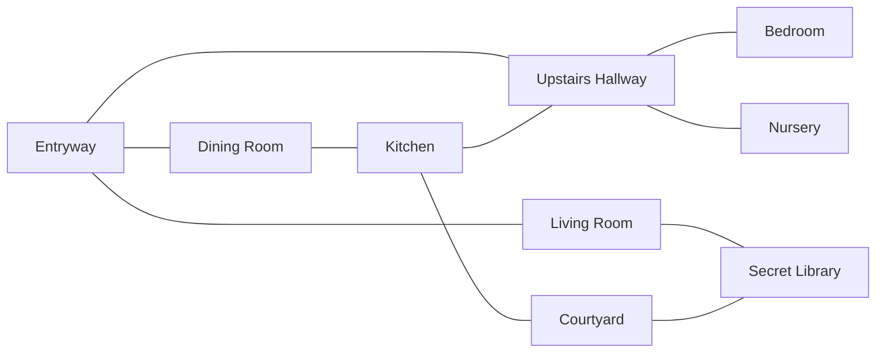

# Halloween Haunted House — Story Bible v2

*Draft, Sept 22, 2026. Replaces Story Bible v1.*

*Revised 26 September 2026 to match the content that has since been built and the decisions taken with the PM. See **What changed in this revision**.*

This version rebuilds the Bible around the revised business requirements. The premise and the family survive. The player cohorts, room locking, the crystal ritual, the Halloween deadline and the win condition are gone. Players now explore the house freely, interact with things and earn achievements, while the house changes on a predefined drop schedule.

Anything marked **(suggested)** is a proposal from this rewrite, not a decision. Anything marked **TBD** needs a decision before it can be built. Both are collected under Open Questions at the end.

---

## What changed from v1

| Area | v1 | v2 |
| --- | --- | --- |
| Dimensions | Players split between A and B; family in a third dimension, C | Two dimensions only. Players and Eunoia are in **A**. Elena, David and Marcus are in **B** |
| Cohorts | Two player groups, two versions of every room | None. One house, one version of every room, shared by all players |
| Room access | Rooms gated; main staircase blocked until David repairs it | Every room open from the start except the Secret Library, which each player discovers for themselves. The main staircase starts crumbled and is repaired by the players together |
| Player goal | Find three crystals, learn the ritual word, reverse the split before Oct 31 | Explore, engage with things, earn achievements. No overall goal, no deadline, no win |
| Story delivery | Daily unlocks toward a finale | **Drops**: at predefined times, new achievements go live, new story is revealed and the house changes |
| Cause of change | Player progress | **Ripples**: something the family did in Dimension B spills over into Dimension A |
| Commands | Not specified | `/pet`, `/look`, `/take`, `/use`, `/drop`, `/inventory`, `/stats` |
| Removed entirely | — | Focusing crystals, ritual word, win sequence, synchronized ritual, epilogue vote, locked upstairs door, cohort-specific descriptions |

---

## What changed in this revision

Release 1's content has been written and validated — 9 rooms, 135 things, 142 pieces of text — and building it settled a number of things this Bible had left open or described differently. Where the two disagreed, the built content won, because it is what players will actually read.

| Area | v2 as drafted | Now |
| --- | --- | --- |
| **Expired cat food** | Hidden behind a cubby door revealed when the oak wardrobe slides aside at the *Follow Your Nose* drop | In the roll-top desk's jammed bottom drawer. The smell is in the Upstairs Hallway **from day one**; each player frees the drawer themselves with graphite powder |
| **Follow Your Nose** | A dated drop with a ripple and an announcement | A per-player discovery, earned whenever that player unjams the drawer. No fixed date |
| **Graphite powder** | One tin in the Nursery | A **source**: the tin never runs out, so every player can take some. It had two competing uses — unjamming the drawer and being sent to David — and a single tin could only serve one player |
| **Cat food flavors** | Chicken, salmon, tuna, gourmet, expired, with vague "stashes in many rooms" | The same five, but each stash is a specific place with its own description, and each yields one flavor |
| **Gourmet wet's hiding place** | TBD | Under the bed in the Bedroom, behind the crate of chicken. The only one in the house |
| **Staircase repair** | Ten players, one plank each, ever | A **per-server number** an admin can change, and one plank per player per **48 hours** rather than one ever. A server of four cannot reach ten |
| **Alexa and the craving** | Possibly new commands, or `/use` with prompts | Neither. Alexa listens for messages beginning "alexa"; the craving is guessed with emoji reactions. Neither adds a command |
| **Coffee maker** | A cold half-pot | A single-serve Keurig with pods, so a player can make fresh coffee rather than only find old coffee |
| **David's grocery list** | "grocery list" | A **to-do list** — it was never mostly groceries |
| **Command list** | Seven | Ten, settled and registered once: `/pet`, `/look`, `/take`, `/drop`, `/use`, `/inventory`, `/stats`, `/enter`, `/initialize-haunted-house`, `/admin_config` |

Two things this revision did **not** decide, and which are still open below: who the players are in-story, and what the drop calendar is.

---

## Premise

Dr. Elena Voss, a paranormal researcher, rented a Victorian house for fieldwork with her husband David and their four-month-old son Marcus. A black cat named Eunoia already lived there and adopted them immediately.

The house is a "thin place," where the wall between worlds is naturally worn. On the fall equinox, **September 22, 2026**, Elena ran a small, careful experiment in the Secret Library to observe that wall. The equinox amplified it far past what she expected. The house split cleanly into two copies of itself:

- **Dimension A** holds the house, every object in it, Eunoia, and — shortly after — the players.
- **Dimension B** holds an identical house, identical objects, and Elena, David and Marcus.

Nobody is hurt and nobody is in danger. The family can't get out of their house, but they're well stocked for a long time. They're simply living in a house next door to itself. They can't see the players, and the players can't see them, but the two houses are still touching. What the family does in B sometimes *ripples* into A. And the one creature who doesn't seem to care much about dimensions is the cat.

The players' job isn't to fix anything. It's to wander the house, poke at things, look after the cat, piece together what happened from what the family leaves behind, and notice as the house keeps changing.

---

## The Split: Backstory

### Before the experiment

- Elena rented the house in early September for fieldwork, bringing her research notes and salvaged equipment.
- Eunoia was already living in the house and bonded with Elena first, then the whole household. Someone had been feeding the cat before the family arrived and left a stash of cat food behind in the bottom drawer of the roll-top desk upstairs. It expired on Sept 1, 2026, just as the family moved in, the drawer has since swollen shut, and nobody has found it.
- David works remotely, handles most of Marcus's daytime care, and is supportive of Elena but skeptical of her research.
- David had just joined Costco and was already buying in bulk, notably cat food.
- The family came and went from the house freely. The doors and windows all worked normally.

### The experiment (September 22, 2026)

- Elena set up a resonance chamber in the Secret Library: copper wire, a hand-drawn diagram, a few mirrors and personal anchor objects.
- She expected a brief, controlled window to observe the other side. Instead the equinox amplified the house's own thinness, and the house split.
- At that moment Marcus was napping in the Nursery, David was upstairs in the bathroom, and Eunoia was pacing the Secret Library. Elena reached for the cat as the light faded; her hand closed on nothing.
- The family ended up in Dimension B. The cat ended up in Dimension A.

### Now

- Both houses are stable and ordinary to live in. Only the connection between them is strange.
- Elena is curious about what happened and suspects something went wrong with her experiment. She documents everything in her field notes. As time goes on, she becomes more and more convinced that the experiment split the house and that she's in a different dimension. She misses Eunoia terribly and worries about where the cat went.
- Since the split, every door and window out of the Dimension B house is stuck fast, except the small library window, which opens fine. That window and the old gnarled oak outside it are the only way into the courtyard, and Elena uses them. Elena starts to suspect the experiment is behind it. David is convinced there's no dimensional split at all: the doors and windows are just jammed. He keeps trying to unstick them with tools, instruction manuals and questions to Alexa.
- Being stuck inside isn't a problem, thanks to David's Costco habit. The pantry is full of food and diapers, Aunt Sue's two dozen frozen breakfast burritos could feed the family for a long time on their own, and the extra freezer in the garage is packed with frozen premade meals from his many Costco trips.
- Marcus is fine. Marcus is always fine.

---

## How the Two Dimensions Touch

These are the only channels between A and B. Every piece of cross-dimension story should arrive through one of them, so the rules stay consistent.

| Channel | Direction | How it shows up in the game |
| --- | --- | --- |
| **Ripples** | B → A | At each drop, something the family did in B changes the house in A: new objects appear, old ones move, room descriptions change |
| **Eunoia** | A → B | When a player pets the cat in a room that has things in it, there's a chance one of those things vanishes to Dimension B (see Crossing Over) |
| **Notes** | B → A | Elena's and David's written notes bleed through as readable pages in rooms and on the bulletin board |
| **The baby monitor** | B → A | The monitor in the Nursery picks up Marcus in Dimension B: cooing, fussing, a lullaby |
| **Alexa** | Both | The smart speaker's cloud lives outside the house, so it's shared. Players can talk to it, and David's reminders and orders show up on it |
| **Mirrors** | B → A | Reflections sometimes show the other house: a figure in a doorway, a room slightly rearranged |
| **Deliveries** | Into A | David's orders (Costco, Amazon, UPS) arrive at the A house's door, because the address is the same in both |

---

## How the Game Plays

### Free exploration

- Every room is open to every player at all times, except the Secret Library, which each player has to discover (see below). There are no other locks, gates or blocked exits.
- Players move between rooms with `/use` on an exit (existing behavior).
- There is no win condition and no deadline. The game runs on a drop schedule through Halloween (end date TBD).

### Commands and their story framing

| Command | What the player does | Notes for writers |
| --- | --- | --- |
| `/pet` | Pet Eunoia | Affects the relationship meter. May send a nearby thing to Dimension B |
| `/look` | Look at the room, or at one thing in the room or in your inventory | Room descriptions and thing descriptions both change over the game |
| `/take [thing]` | Put a thing in your inventory | Only things marked takeable |
| `/use [thing]` | Use a thing, or use an exit to move rooms | What happens can depend on the room you're in, what you're carrying and the date |
| `/drop [thing]` | Leave a thing in your current room | Dropped things join the room's list of available things for every player |
| `/inventory` | See what you're carrying | Private reply |
| `/stats [member]` | See your number of cat pets, your relationship status with Eunoia, how many days you've matched the cat's craving, and the achievements you've earned, each with the line explaining how. Your own stats only in Release 1; looking up another member comes later | Private reply. Format in the Release Timeline |

**Context-aware `/use`.** Several achievements need an object used in a specific place or with other objects in hand: sanitizing bottles in the Kitchen, carving a pumpkin in the Courtyard, cooking with three ingredients. With only single-object `/use`, the rule is: **what `/use` does depends on where you are and what you're carrying.** For example, `/use bottle` in the Kitchen sanitizes a used bottle; `/use stove` while carrying all three ingredients cooks the recipe.

**Which thing, then which copy.** A name is settled in two passes. First, if what the player typed matches *different things* within reach — "cat food" where they're carrying chicken and the room holds salmon — the bot asks which they mean and does nothing until they say. Then, with one thing agreed, **the copy in their inventory comes first**, falling back to a loose one in the room, then to the stash.

A stash and the cans it hands out count as **one thing**, not two, so a player carrying chicken and standing by the chicken stash is never asked "chicken or chicken?"

The reply always says which one was used, for example *"You unwrap a piece of candy from your bag"* versus *"You grab a piece of candy from the bowl on the sideboard."* This only matters for takeable things; fixed things like the stove or spirit board are never in an inventory.

**No need to pick things up first.** A player doesn't have to take a thing before using it. If they aren't carrying candy and type `/use candy`, they eat the candy in the room.

**Things that change when used.** Some things turn into a different thing when used. `/use bottle` in the Kitchen removes a **used baby bottle** and replaces it with a new thing, a **sanitized baby bottle**, in the same place: the player's inventory if it came from there, otherwise the room. The two are separate things, so `/use bottle` always acts on a used bottle; a sanitized bottle has nothing left to sanitize.

**Follow-up prompts.** Some things need more than a name to use. For these, `/use` replies privately with a player picker or a room picker. The bedsheet and the spirit board (below) work this way.

**Two interactions are not commands at all.** Talking to Alexa and guessing the cat's daily craving looked like they needed their own commands, and they don't — Alexa listens for ordinary messages, and the craving is guessed with emoji reactions. Neither adds to the command list, which matters because slash commands register once and take about an hour to propagate. The full list is ten: `/pet`, `/look`, `/take`, `/drop`, `/use`, `/inventory`, `/stats`, `/enter`, and the admin commands `/initialize-haunted-house` and `/admin_config`.

### Finding the Secret Library

The Secret Library is the one room players have to discover. Each player unlocks it for themselves; one player finding it doesn't open it for anyone else.

**Step 1: the window (Courtyard → Secret Library, exit `CS`).** There's no door from the Courtyard. Instead, an old, gnarled oak tree grows against the house.

**The Courtyard itself is always open.** The Kitchen's back door to the Courtyard is an ordinary exit, open to every player from launch. Only the way from the Courtyard into the library is hidden. (The stuck doors are a Dimension B problem; they never block players.)

**Hints.** David's Oct 3 note says the library window is the only window in the house that isn't stuck. His Oct 7 note says he saw Elena up in the old gnarled tree in the courtyard again: a good climbing tree, but unusual, even for her.

**Achievement.** The first `/use tree` earns the secret achievement *Out on a Limb*.

- `/use tree` the first time:

  > You grab the lowest branch and haul yourself up into the old oak. Halfway up, you notice a small window tucked behind the ivy, open just a crack. You ease it wider. Stale, charged air drifts out. You hesitate for a moment… then swing a leg over the sill and climb through. You find yourself in a small, close room lined floor to ceiling with books. A library.

  The player is moved into the Secret Library. From then on, the window is a normal exit for that player in both directions (suggested):
  - `/use tree` again: *You climb the old oak and slip in through the library window.*
  - From the library, `/use window`: *You swing out over the sill and climb back down the oak.*

**Step 2: the skeleton key.** In the Secret Library, an old iron **skeleton key** hangs on a nail by the shelves.

- Each player can take **one** key. It can't be dropped, taken from another player or sent to Dimension B by the cat (the same rules as the carving tools).
- `/take skeleton key`: *You lift the key off its nail. It's heavy, cold and very old. It's yours now.*
- Second take: *You already have the key.*

**Step 3: the curiosity cabinet (Living Room ↔ Secret Library, exit `LS`).** The Living Room's tall curiosity cabinet is the library's real door, locked until the player has the key.

- `/look curiosity cabinet`: *A tall curiosity cabinet with glass doors, full of odd little objects: a stuffed owl, a jar of marbles, a brass compass that doesn't point north. There's an old-fashioned keyhole in the frame.*
- `/use curiosity cabinet` without the key: *You tug at the glass doors. Locked. The keyhole is big and old-fashioned, the kind that takes a skeleton key.*
- `/use curiosity cabinet` with the key, the first time:

  > You fit the skeleton key into the lock and turn it. Something clunks deep inside the wall. Instead of the glass doors opening, the whole cabinet swings outward on a hidden hinge. Behind it, a narrow doorway leads into a small room lined with books. It's a secret door into the library.

  The passage is now unlocked for that player for good, and they never need the key for it again.
- `/use curiosity cabinet` after that: *The cabinet swings open on its hidden hinge, and you step through into the library.*
- From inside the library, before the passage is unlocked, the exit to the Living Room is the back of the cabinet (suggested): *The doorway is blocked by the back of a heavy cabinet. There's a keyhole on this side too.* With the key, it unlocks the same way.

**What players see before they find it:** the Secret Library doesn't appear in their exits from the Living Room or the Courtyard. They can still see the curiosity cabinet and the oak tree.

### Repairing the main staircase

The main staircase between the Entryway and the Upstairs Hallway starts out crumbled and unusable. Repairing it is a job for the whole server. Until then, players reach the Upstairs Hallway by the Kitchen's back stairs.

- **Lumber arrives in the Entryway every day** until the staircase is fixed. Story reason (suggested): David ordered lumber in bulk to fix the jammed door frames in Dimension B, and like his other orders, it's delivered to the same address in Dimension A.
- **`/use lumber`** counts one repair for that player:

  > You haul a plank over to the staircase and hammer it into place. The steps look a little less like a ruin. \[N\] of \[total\] repairs done.
- **The number of planks is set per server** and an admin can change it mid-game with `/admin_config planks_required`. Ten was the original figure and it is a trap for a small server: four players can never reach it, and the Upstairs Hallway would stay reachable only by the Kitchen back stairs for the whole game. Set it from the real population. Lowering it below the planks already placed finishes the staircase immediately rather than leaving it stuck.
- **One plank per player per 48 hours**, rather than one ever. That is the lever that lets the same content suit a server of four and a server of forty: ten players can finish it in a day, three players can finish it over a week. Trying again inside the window (suggested): *You've set your plank. Your shoulders will want about \[time\] before the next one.*
- **When the last plank goes in,** the staircase is fixed for everyone. Announcement in all rooms (suggested):

  > With a last bang of the hammer, the main staircase stands whole again: a grand old staircase, patched in places with fresh, pale wood.
- **After that,** `/use staircase` moves a player between the Entryway and the Upstairs Hallway in either direction, and lumber stops arriving.
- **Before that,** `/use staircase` (suggested): *The staircase is crumbled and unsafe. Whole steps are missing. It'll take more than one pair of hands to fix it.*

Descriptions:

- Entryway, before: *The grand staircase is a ruin: steps cracked or missing, the banister hanging loose. A stack of fresh lumber leans against the wall beside it.*
- Entryway, after: *A grand staircase sweeps up to the floor above, patched here and there with fresh, pale wood.*
- Upstairs Hallway, before: *At the top of the main staircase, the steps drop away into splintered gaps.*
- Upstairs Hallway, after: *The main staircase leads back down to the Entryway, its patched steps solid underfoot.*

### The ghost of the day

Each day one player in the server is secretly chosen as the house's ghost. The ghost can haunt one room at a time with an anonymous message. Everyone else can try to work out who it is.

**Becoming the ghost**

- At the daily changeover (midnight Pacific), the bot picks one player at random from those who have entered the house. The pick is completely random, so the same player can be the ghost two days in a row.
- A **bedsheet with eyeholes** appears in that player's inventory. Inventories are private, so nobody else can tell.
- The next time the new ghost runs any command, they get a private notice (suggested): *"Something soft and faintly musty has appeared in your bag. It's a bedsheet with two eyeholes cut in it. You feel oddly… translucent."*

**Haunting**

- The ghost types `/use bedsheet` from any room.
- The bot privately asks them to **pick a room**, then to **type their message** in a pop-up box.
- The message is posted, unsigned, in that room for everyone there to see, in this frame:

  > A sheet-draped shape drifts through the door and whispers "*\[the ghost's message\]*"
- The ghost can haunt **as many times as they like** while they hold the bedsheet. There's no length limit on the message and no moderation.
- The first haunting earns the ghost **Getting into the Spirit**.

**What the ghost sees at each step.** The ghost should always know that their text goes inside the whisper. Suggested wording:

| Step | Bot text (private to the ghost) |
| --- | --- |
| After `/use bedsheet` (room picker) | *You pull the bedsheet over your head. Which room will you haunt? Everyone in that room will see: A sheet-draped shape drifts through the door and whispers "…" (you'll write the whisper next).* |
| Pop-up box title | *Haunt the \[room name\]* |
| Text box label | *What do you whisper?* |
| Text box placeholder | *Players will see: A sheet-draped shape drifts through the door and whispers "…"* |
| After posting | *You drift into the \[room name\] and whisper "\[message\]".* |

Discord caps the pop-up title and label at 45 characters and the placeholder at 100, so the full explanation goes in the room-picker message. The placeholder repeats it in short form.

**Bedsheet rules**

- It can't be dropped. `/drop bedsheet` gets a refusal (suggested: *"The bedsheet clings to you. It isn't done with you yet."*).
- Nobody can take it from the ghost, and petting the cat can't send it to Dimension B.
- When the ghost role passes to someone else at the next changeover, the bedsheet vanishes from the old ghost's inventory and appears in the new ghost's.

**Catching the ghost: the spirit board**

- Elena's **spirit board** sits in the Secret Library. It can't be taken, so players have to go there to use it.
- A player types `/use spirit board`, and the bot privately asks them to **pick a player** they suspect.
- The answer is private:
  - Right: *"The planchette slides slowly across the board… and stops on YES."* This earns **Ghostbuster**.
  - Wrong: *"The planchette slides slowly across the board… and stops on NO."*
- Each player gets **one accusation per day**. After that: *"The planchette won't move. The board seems tired. Try again tomorrow."*
- Nobody can pick themselves, so the ghost can't earn Ghostbuster by naming themselves.
- An accusation only counts against the current day's ghost.

### The shared house

There's one house, and every player in a server shares it. If one player takes the last chocolate bar, it's gone for everyone until something puts another one back. Dropped items stay where they're dropped. This is what makes the group achievements work, and it's why Eunoia sending things to Dimension B matters.

### Eunoia and the relationship meter

- Each player has their own relationship with Eunoia, from -100 to 100, starting at 50.
- Petting gently and not too often builds it. Pestering the cat makes it standoffish.
- Eunoia seems to perceive things players can't: staring at mirrors, pawing at empty air, sitting outside the Nursery as if listening.
- The cat appears at every player's side when they arrive and follows each of them. There is one Eunoia, somehow everywhere at once.

---

## Drops and Ripples

> **Two words that are not the same, settled 26 September.** A **release** is a deployment — code and content files shipped together, numbered for the repository's benefit. A **drop** is a moment when something becomes visible to players. One release can carry a month of drops.
>
> For anyone writing content this means **you are writing drops.** Write all of October in September and hand it over in one batch; each piece still arrives on the day its drop says. This section is about drops. "Release 1" still appears where it means the first batch of files that shipped, which is a different thing.

A **drop is a predefined moment when the game moves forward. Each drop** can contain any of the following:

| Part | What it is |
| --- | --- |
| **Achievements** | New achievements become available to earn |
| **Story reveal** | New notes from Elena or David appear, explaining a little more of what happened |
| **Ripple** | The in-story cause: what the family did in Dimension B that changed Dimension A |
| **House changes** | Room descriptions rewritten; things added, removed or moved |
| **Announcement** | A short message players see when the drop happens |

### Writing a ripple

Each ripple should follow one pattern: the family does something ordinary in B, and A changes as a side effect.

> **Example (suggested):** David finally tightens the loose kitchen cabinet hinges in B. In A, every cabinet door in the Kitchen swings open at once, and a sealed can of salmon cat food rolls out onto the floor.

The ripple tells players *why* the house changed. The accompanying note from David or Elena usually shows the B side of the same event.

### Drop template

Use this for each drop in the schedule.

```
Drop #:
Goes live:        (date and time, Pacific)
Ripple:           (what the family did in B)
Story reveal:     (notes that appear, and where)
Achievements:     (that go live now)
Room changes:     (room to what changes in its description)
Things added:     (thing, room, how many)
Things removed:   (thing, room)
Announcement:     (player-facing text)
```

### Drop schedule (skeleton)

Only the date-based achievements have fixed dates so far. The rest need to be placed.

| Date | Drop | Fixed content |
| --- | --- | --- |
| Launch (TBD) | Drop 1: the house as players first find it | Starting achievements (TBD) |
| Oct 1 | Coffee Day / Raccoon Day | Coffee maker and trash can achievements |
| Oct 2 | World Smile Day | Mirror achievement |
| Oct 15 | International Day of Rural Women | Watering can achievement |
| Oct 21 | International Day of the Nacho | Nacho chips achievement |
| Oct 25 | World Pasta Day | Pasta pot achievement |
| — | *Follow Your Nose* | **No longer a drop.** A per-player discovery, available from launch: free the roll-top desk's jammed drawer with graphite |
| TBD, late October | *Forwarding Address* | A letter for L arrives; players forward it to the right address |
| Oct 31 | Halloween | Finale drop (see the Release Timeline) |
| Tuesdays | Trash day | Trash day achievement |

All dates and times are Pacific, matching the bot's existing midnight job.

### Example drop

*Follow Your Nose was the worked example here, and it is no longer a drop — it became a per-player discovery available from launch (see the Upstairs Hallway). A dated drop still needs a worked example; the Oct 21 nacho achievement or the Forwarding Address letter would both serve.* **TBD.**

What the change illustrates is worth keeping, because it will come up again: a drop makes something happen to everyone at once, and a discovery makes something happen to one player when they earn it. Reach for a drop when the house itself should change — new things, new descriptions, an announcement. Reach for a discovery when the point is the moment of working it out, because a drop spends that moment on whoever happens to be online.

---

## Crossing Over: Things Moving Between Dimensions

### A to B: the cat

When a player uses `/pet` in a room that contains things, there's a chance (X%, TBD) that one random thing in that room vanishes to Dimension B. Some things are more likely to cross than others. Graphite powder, for example, has a higher chance.

What players see (suggested):

> Eunoia leans into your hand, purring — and the tin of graphite powder on the windowsill is simply not there anymore.

Only things lying in a room can cross. Anything in a player's inventory is safe, so dropping something is always a risk, but crossing is a chance, not a certainty.

**Design tension to keep:** players stockpiling items in a room for a group achievement risk losing some every time someone pets the cat there. That's a feature. It gives players a reason to talk to each other.

### B to A: ripples

Things only arrive from Dimension B at drops, as part of a ripple. The five baby bottles on the Secret Library shelf are the first example: they came across from B, which is why they look used.

### Does the family react?

Recommendation: the family's reactions are written into later drops. They happen whether or not any player actually sent the item, with an optional variant if someone did (for example, if graphite powder crossed over, David's next note thanks "whoever keeps leaving me exactly what I need"). Whether the bot tracks that is TBD.

---

## Achievements

There are three kinds:

- **Public**: listed where players can see them once their drop arrives, so players know what to aim for.
- **Secret**: hidden until earned. Players discover them by experimenting, and the fun is in not being told.
- **Group**: earned by the server's players together rather than by any one person.

A **bonus** achievement is not a fourth kind. It is either of the two earned by going beyond a base achievement's requirement: the base achievement's condition, plus a constraint on top of it. A player cannot earn the bonus without also earning its base.

**How achievements are shown** (*decided*):

- When anyone earns an achievement of any kind, the bot posts a public announcement in the Halloween channel with the achievement's **name only**, never its description. A secret achievement's name going up is itself a hint that something is there to find.
- The player who earned it gets the description in a private unlock message.
- `/stats` lists only achievements a player has earned. Any player can look up another server member's `/stats`.

**All thirty-five achievement names below are final and approved.** Every name is set in bold; nothing in these tables is a placeholder or a suggestion any more.

### Public achievements

| Achievement | How to earn | Where | Story tie-in |
| --- | --- | --- | --- |
| **Passing a Message to David** | Talk to Alexa and remind David to cancel the auto-delivery | Any room (there's an Alexa in every room) | Alexa is shared between dimensions, so a message left with her reaches him. His standing auto-delivery keeps arriving |
| **Charcuterie Board** | Collect all five cat foods: chicken, salmon, gourmet wet, tuna and expired | Around the house | Chicken, salmon and tuna are in stashes around the house. Expired is plentiful too, but only once that player has freed the jammed drawer. Gourmet wet is one can per player, under the bed. See Cat food |
| **Found the Specs** | Find David's reading glasses in the roll-top desk | Upstairs Hallway | He left them with a door-hardware manual when the baby monitor went off |
| **Something's Cooking** | Collect herbs, dark chocolate and a spice, then use the kitchen | Courtyard, Living Room, Entryway to Kitchen | Herbs from the garden; chocolate David hid from himself; spice from an Amazon box |
| **Unsticking the Situation** | Send the graphite powder to Dimension B | Nursery | David needs it for the jammed doors. Higher chance of crossing |
| **Catproof the House** | Hold five baby bottles (clean or dirty) in your inventory at once | anywhere | The bottles came across from B. Left loose, Eunoia will knock them over |
| **Return to Sender** | Send the baby bottles back to Dimension B | Secret Library / anywhere | Marcus needs them. Players who did this the day before the drop earn it automatically |
| **It Takes a Village** — bonus | Turn all five used bottles into sanitized bottles in the Kitchen, then send them back | Kitchen | David would appreciate it |
| **Gourd Job** | Find the carving tools in the unpacked box, then carve a pumpkin. Each player gets their own set | Bedroom to Courtyard | The family meant to carve pumpkins together |
| **Follow Your Nose** | Find the source of the weird smell: free the roll-top desk's jammed bottom drawer with `/use graphite` | Upstairs Hallway | Available from launch, earned per player rather than at a drop. The smell is in the hallway from day one; the drawer is swollen shut. The clue trail runs through the to-do list, the door-hardware manual and the laptop, all of which point at graphite. Behind the drawer is a stash of expired cat food (the smell) and L's note, *"Use by 9/1/26 — L"*, the first clue about Lucille Marsh, the former resident |
| **Baby Talk** | Find the baby monitor that's making strange noises | Nursery | It's picking up Marcus in Dimension B |
| **Dressed for the Season** | Wear a costume found in the bedroom | Bedroom | From the unpacked Halloween box |
| **Met the Craving** | Work out the cat's craving for the day by reacting with food emoji | Anywhere | One craving per day, **the same for every player on the server**, so guessing is collaborative. Drawn from the Unicode Food & Drink group minus dishware, around 120 emoji. The bot answers with reactions: 👀 right food subgroup, ❌ the 20th slot with no winner, 😻 found |
| **Forwarding Address** | Work out who L is from hints across the month, then `/use letter` and pick L's correct new address | Entryway (letter arrives) | A letter for L is delivered late in the game. See L, the former resident |

### Group achievements

| Achievement | How to earn | Notes |
| --- | --- | --- |
| **Strength in Numbers** | Players together drop 25 identical things in one room | 25 cans of one common cat food flavor will do it |
| **Overdue Returns** | Players together pile 200+ things into any one room | Any room counts, not only the Secret Library. The cat can send things away, so players have to coordinate |
| **The Feline Collection** — bonus | 100+ of that same room's things are cat food | One room has to hold both totals at the same time |

### Secret achievements

| Achievement | How to earn | Notes |
| --- | --- | --- |
| **A Little Bit Lost** | Go Entryway to Living Room to Entryway five times within five minutes |  |
| **Out on a Limb** | Find the Secret Library by climbing the oak tree in the Courtyard (first `/use tree`) | See Finding the Secret Library |
| **Bulk Buyer** | Carry 25 cans of cat food | A nod to David's Costco habit |
| **Making Friends** | Pet the cat 200 times with a positive relationship |  |
| **Trying to Make Friends** | Pet the cat 200 times while your relationship is zero or below |  |
| **Cat's Best Friend** | Reach a perfect relationship with Eunoia | Perfect means a relationship score of 100, the top of a meter that runs −100 to 100 |
| **Signed, Sealed, Delivered** | `/use intercom` within three minutes of the doorbell ringing | The doorbell is a live event the bot announces. Delivery driver dialogue TBD |
| **Brewing Trouble** | Use the Keurig on Oct 1 | International Coffee Day |
| **Trash Panda** | Use the trash can on Oct 1 | International Raccoon Appreciation Day. The achievements doc gives Oct 1 in one place and Oct 2 in another; Oct 1 is the real date |
| **Say Cheese** | Use a mirror on Oct 2 | World Smile Day. Any mirror in the house counts: the ornate mirror (Entryway), the cracked mirrors (Secret Library) or the dresser mirror (Bedroom) |
| **Green Thumb** | Use the watering can or take herbs or use (carve) pumpkin on Oct 15 | International Day of Rural Women |
| **Nacho Average Ghost** | Use the nacho chips on Oct 21 | International Day of the Nacho |
| **Using Your Noodle** | Use the pasta pot on Oct 25 | World Pasta Day |
| **Getting into the Spirit** | As the day's ghost, haunt a room with `/use bedsheet` | One random player per day is the ghost. See The ghost of the day |
| **Ghostbuster** | Correctly name the day's ghost with `/use spirit board` | Secret Library. One accusation per player per day |
| **Breaking into the Halloween Candy** | `/use candy` to eat it |  |
| **Curbside Pickup** | Take out the trash on a Tuesday | `/use trash can` on a Tuesday takes out the trash |
| **Not-So-Picky Eater** | Eat ten frozen burritos from the Kitchen freezer | Aunt Sue's bulk order. Each one is still frozen in the middle, and reading that ten times is the joke |

> **Command check:** the achievements document's `/haunt` and `/accuse` are now handled by `/use bedsheet` and `/use spirit board`, and its option to catch the ghost by replying with their name has been dropped. Talking to Alexa and guessing the craving are settled: neither is a command. Alexa listens for messages beginning "alexa", "hey alexa" or "ok alexa"; the craving is guessed with emoji reactions.

---

## The House

Nine rooms, all open. There's one version of each room. The map is unchanged from the current bot:



Connections: Entryway–Dining Room, Entryway–Living Room, Entryway–Upstairs Hallway, Dining Room–Kitchen, Kitchen–Courtyard, Kitchen–Upstairs Hallway, Living Room–Secret Library (the curiosity cabinet, exit `LS`: locked for each player until they have the skeleton key), Courtyard–Secret Library (the oak tree and window, exit `CS`: hidden until the player uses the tree), Upstairs Hallway–Bedroom, Upstairs Hallway–Nursery.

Room descriptions below are **drafts of the Release 1 state**, meant to be shown with `/look`. They're kept short enough for a Discord message. Exit descriptions replace the `EL_desc`-style placeholders currently in the bot.

For each thing: **Take** means it can go in an inventory. **Achievement** links it to the list above.

### 1. Entryway (arrival point)

> A tall foyer with a high, water-stained ceiling. A coat rack leans under a jumble of jackets, and an ornate mirror hangs beside the front door, its silvering gone cloudy at the edges. A stroller is parked in the corner next to a pile of shoes, including a pair of tiny knit booties. A cork bulletin board by the door is layered with notes. Beside it, a smart speaker blinks a patient blue ring. Someone has left an Amazon box, half-opened, at the foot of the stairs.

**Exits:** the arched doorway to the Dining Room · the wide doorway to the Living Room · the main staircase to the Upstairs Hallway (only once repaired; see Repairing the main staircase)

| Thing | Take | What it's for | Achievement |
| --- | --- | --- | --- |
| Alexa (smart speaker) | No | Talk to it; it has David's reminders and orders. **There's an Alexa in every room** | Passing a Message to David |
| Lumber | No | `/use lumber` counts toward repairing the main staircase. Arrives daily until it's fixed | — |
| Intercom | No | Answer the door when the doorbell rings | Signed, Sealed, Delivered |
| Amazon box | No | Contains the spice jar. Its description does **not** name the jar, so it stays true once somebody takes it | Something's Cooking |
| Spice jar | Yes | Recipe ingredient, inside the box | Something's Cooking |
| Ornate mirror | No | Reflections occasionally show the other house | Say Cheese (Oct 2) |
| Bulletin board | No | Archive of every note that has dropped | — |
| Coat rack | No | A cardboard flat of **salmon** is tucked in behind it | Charcuterie Board / Bulk Buyer |
| Stroller, shoes, booties | No | Flavor: a baby lives here | — |

### 2. Dining Room

> A long wooden table is set for three: two plates and a high chair pulled up at the end, its tray crusted with dried sweet potato. Two chairs are pushed back as if their owners stood up in a hurry, and a wine glass lies on its side above a dark stain. A bowl of Halloween candy sits on the sideboard next to a vase of wilting flowers. Tall windows look out over a garden that's slowly winning.

**Exits:** the arched doorway to the Entryway · the swinging door to the Kitchen

| Thing | Take | What it's for | Achievement |
| --- | --- | --- | --- |
| Bowl of Halloween candy | No | A **source**: the bowl stays on the sideboard and never empties | — |
| Piece of candy | Yes | Eat it. Taken from the bowl | Breaking into the Halloween Candy |
| David's to-do list | No | "Milk, diapers, WD-40, graphite powder?, check door hinges, CANCEL AUTO-DELIVERY (I need a reminder!!!)" — renamed from "grocery list", since it was never mostly groceries | Clue for Passing a Message to David **and** for the jammed drawer |
| David's journal page | No | His account of the night of the experiment | — |
| Silver baby spoon | Yes | Flavor | — |
| Candle stub | Yes | Flavor; left from the experiment | — |
| Sideboard | No | Its cupboard holds a stash of **salmon** | Charcuterie Board / Bulk Buyer |

### 3. Kitchen

> A big old-fashioned kitchen with a cast-iron stove, a deep sink and a pantry door that won't quite shut, because the pantry behind it is stacked to the shelf edge with cat food. An empty drying rack sits by the sink, as if waiting for bottles. The single-serve Keurig has a carousel of pods beside it and a clean mug waiting underneath. A tall fridge-freezer hums in the alcove beside a kitchen bin, its bag tied off and ready to go out. A narrow back staircase disappears upward behind the pantry. A pasta pot sits out on the counter, its lid resting crooked.

**Exits:** the swinging door to the Dining Room · the back door to the Courtyard · the back stairs to the Upstairs Hallway

| Thing | Take | What it's for | Achievement |
| --- | --- | --- | --- |
| Stove | No | Cook with all three ingredients | Something's Cooking |
| Sink | No | `/use bottle` here turns a used baby bottle into a sanitized baby bottle | Squeaky Clean |
| Keurig | No | A single-serve machine with pods beside it, so a player can **make** fresh coffee rather than only find a cold pot. Use on Oct 1 | Brewing Trouble |
| Trash can | No | Use on Oct 1; take out on Tuesdays | Trash Panda / Curbside Pickup |
| Pasta pot | No | Use on Oct 25 | Using Your Noodle |
| Nacho chips | Yes | Use on Oct 21. Not named in the room description, because one player takes them and the description would then be lying | Nacho Average Ghost |
| Pantry | No | Holds the **tuna** stash, towers of cans squared off at the corners | Charcuterie Board / Bulk Buyer |
| Gourmet wet cat food | — | **Not here.** The jar labelled "EUNOIA — PREMIUM" that used to sit on this counter has gone; the one tin is under the bed in the Bedroom | Charcuterie Board |
| Freezer: Aunt Sue's breakfast burritos | No | Flavor: "From Aunt Sue — 2 dozen! To help you both adjust to parenthood!" | — |

### 4. Courtyard

> An overgrown walled garden. Ivy has swallowed half the stone wall, and an herb bed of lavender, sage and rosemary has run completely wild. In the center, a ring of flat stones marks where someone drew a diagram in chalk, now mostly rained away. A picnic blanket is spread over a bench, and a baby's sunhat lies in the grass with a wooden rattle beside it. A row of uncarved pumpkins waits by the door. A dented watering can sits beside the herbs. An old, gnarled oak leans against the house, one thick branch reaching toward a small window half hidden in the ivy.

**Exits:** the back door to the Kitchen (always open) · the oak tree, up to the Secret Library window (only once the player has used the tree)

| Thing | Take | What it's for | Achievement |
| --- | --- | --- | --- |
| Herb garden | No | A **source**: the bed stays put and the cuttings are what you carry | Something's Cooking |
| Herbs | Yes | Recipe ingredient, cut from the garden | Something's Cooking |
| Pumpkins | No | Carve with the tools (context `/use`) | Gourd Job |
| Watering can | No | Use on Oct 15 | Green Thumb |
| Stone circle | No | Flavor; where Elena tested the diagram before moving indoors | — |
| Sunhat, rattle, picnic blanket, bench, ivy, stone wall | No | Flavor | — |
| Oak tree | No | `/use tree` climbs to the library window: the way into the Secret Library | — |

### 5. Living Room

> A comfortable room built for long evenings: a deep sofa, two armchairs and a fireplace full of cold ash. The bookshelves hold a strange mix of spiritualism, dimensional theory and home-repair manuals. One armchair has been turned to face a bare patch of wall. A baby blanket is draped over the sofa, and soft blocks are scattered across the rug. In the corner stands a tall curiosity cabinet, its glass doors locked.

**Exits:** the wide doorway to the Entryway · the curiosity cabinet to the Secret Library (only once the player has unlocked it with the skeleton key)

| Thing | Take | What it's for | Achievement |
| --- | --- | --- | --- |
| Bookshelves | No | One dimensional-theory book is hollow. The description says the block is hollow, not what is in it | Something's Cooking |
| Dark chocolate | Yes | Recipe ingredient, inside the hollow book; David hid it from himself | Something's Cooking |
| Sofa | No | A stash of **chicken** is pushed back underneath, against the skirting | Charcuterie Board / Bulk Buyer |
| Fireplace | No | Cold ash, and Elena's research journal on the mantel above | — |
| Elena's research journal | No | Her field notes; new pages appear over the game | — |
| Armchairs | No | One turned to face a bare patch of wall, David's legal pad down the side of the cushion | — |
| David's legal pad | No | His notes on Elena's theories | — |
| Curiosity cabinet | No | Locked. With the skeleton key, it swings open on a hidden hinge: the secret door to the library | — |

### 6. Secret Library

> A small, close room hidden behind the Living Room's curiosity cabinet. Every wall is shelves: occult references, folklore, a few paperback thrillers that must be David's. A circle of scorch marks is burned into the floorboards, surrounded by copper wire and cracked mirrors. A spirit board lies on the floorboards just outside the circle, its planchette resting on the S. The air feels charged, like the moment before a storm. An empty cat bed sits in the corner.

**Exits:** the back of the curiosity cabinet to the Living Room (locked until the player has the key) · the window, down the oak to the Courtyard

| Thing | Take | What it's for | Achievement |
| --- | --- | --- | --- |
| Library shelves | No | Occult references, folklore and David's thrillers. The ritual diagram is pinned to a shelf edge | — |
| Scorch circle | No | Where the experiment happened | — |
| Ritual diagram | No | Elena's diagram, pinned to the shelf edge; readable | — |
| Copper wire coil | No | A **source**: Elena's salvaged wire, paid out and re-wound many times | — |
| Cracked mirrors | No | Flavor; show glimpses of the other house | Say Cheese (Oct 2) |
| Empty cat bed | No | Eunoia hasn't slept here since the split | — |
| Spirit board | No | Elena's board. Accuse a player of being the day's ghost | Ghostbuster |
| Skeleton key | Yes, one per player | Unlocks the curiosity cabinet passage to the Living Room. Can't be dropped, taken from another player or sent to Dimension B | — |

The Secret Library is not the only room that can earn *Overdue Returns* — any room holding 200+ things does it — but it is still the natural hoard, so its description should change as it fills up (e.g. at 50, 100 and 200 things).

### 7. Upstairs Hallway

> A long hallway lined with faded family portraits that don't belong to anyone living here. A roll-top desk stands against the wall, its lid half closed on a tangle of papers, and a heavy oak wardrobe looms beside it, a short crowbar lying on the floor against the skirting board. A bad smell has got into the hallway — faint by the portraits, worse by the desk. Baby clothes hang over the railing to dry. Doors lead to a bedroom and a nursery, where a soft hum of white noise leaks out. At one end is the top of the main staircase; at the other, a narrow back stair drops toward the Kitchen.

**Exits:** the main staircase to the Entryway (only once repaired) · the back stairs to the Kitchen · the door to the Bedroom · the door to the Nursery

| Thing | Take | What it's for | Achievement |
| --- | --- | --- | --- |
| Roll-top desk | No | The lid opens normally; the bottom drawer is swollen shut | Found the Specs / Follow Your Nose |
| David's reading glasses | Yes | Inside the desk, reachable from day one | Found the Specs |
| Door-hardware manual | No | Readable; David's bookmarked page on freeing stuck locks and hinges: *"apply powdered graphite, never oil"* | Clue for the jammed drawer |
| Bad smell | No | Present from day one. `/look smell` points at the desk without giving away the drawer | Follow Your Nose |
| Small crowbar | No | Flavor: David's investigation. Deliberately **not** the answer to the drawer | — |
| Oak wardrobe | No | Flavor | — |
| Faded portraits | No | They belonged to L. A good place for hints about who L is | Forwarding Address |
| Expired cat food | Yes, once the drawer is free | A stash in the bottom drawer. Hidden until that player unjams it | Charcuterie Board / Bulk Buyer |
| L's note | No | In the drawer. Reads: *"Use by 9/1/26 — L"* | First hint for Forwarding Address |

**The jammed drawer.** This replaces the wardrobe and cubby from the earlier draft. The smell is in the hallway from launch, so every player knows something is wrong up here long before anyone finds it; what they cannot do is reach the source.

The clue trail is already in the house and uses things that otherwise do nothing: the **to-do list** in the Dining Room reads *"graphite powder?, check door hinges"*, the **door-hardware manual** on the desk is bookmarked at *"apply powdered graphite, never oil"*, and the **laptop** in the Bedroom has "graphite vs WD-40" open. The graphite itself is a tin on the Nursery windowsill. The crowbar in this hallway is a deliberate wrong answer.

`/use graphite` in the Upstairs Hallway frees the drawer **for that player, permanently**. It is per-player and not server-wide, because the discovery is the content: if the first player to solve it opened the drawer for everyone, nobody else would get the moment.

- `/look smell`: *Something up here has gone off. It is faint by the portraits and unmistakable by the desk: sweetish, meaty, and patient. You start breathing through your mouth and regret that too.*
- `/use smell`: *You take one deliberate breath, which is a mistake. It is coming from the desk, and from low down in it.*
- `/use desk`, before: *You roll the lid all the way up. Papers, pens, a dried-out highlighter. The deep bottom drawer doesn't move at all — swollen shut in its runners — and whatever is behind it is the reason this hallway smells.*
- `/use graphite` here, the first time (suggested):

  > You work the powder into the runners with a thumb and haul. The drawer gives all at once, and the smell comes up at you like something with weight to it.
- `/use desk`, after: *The bottom drawer slides out easily now. It is packed with cans of cat food that went off a very long time ago, and the smell comes up at you like something with weight to it.*
- `/take expired cat food` before the drawer is free: *You can smell it, but where is it coming from?*
- `/take expired cat food` after (suggested): *You pry a tin loose from the stack and immediately regret breathing in. It goes in your bag anyway.*

**Achievement.** *Follow Your Nose* is earned by the player who frees the drawer. It is no longer a dated drop.

### 8. Bedroom

> The main bedroom: an unmade bed, a dresser with its drawers half open, and a tall mirror over the dresser that catches the light at odd angles. A bottle warmer sits on the nightstand. In the corner, an unpacked moving box labeled HALLOWEEN overflows with costumes, a "Trick-or-Treat" welcome mat and a tangle of fake spider web.

**Exits:** the door to the Upstairs Hallway

| Thing | Take | What it's for | Achievement |
| --- | --- | --- | --- |
| Halloween box | No | Contains the carving tools, the costumes and the cookie cutters | Gourd Job / Dressed for the Occasion |
| Carving tools | Yes, one set per player | Carve a pumpkin in the Courtyard. Every player can take one set. A set can't be dropped, taken from another player or sent to Dimension B by the cat | Gourd Job |
| Costume | Yes | Wear it. Drawn from the costume pile in the box | Dressed for the Occasion |
| Pumpkin cookie cutters, spider web, welcome mat | Varies | Flavor | — |
| Cat collar | Yes | Inscribed "Eunoia"; how players learn the cat's name. **Not named in the room description** — one player takes it | — |
| Unmade bed | No | A crate of **chicken** is shoved underneath, within arm's reach of the pillow | Charcuterie Board / Bulk Buyer |
| Gourmet wet cat food | Yes, one per player ever | Pushed in behind the crate, further back than you would reach by accident. **The only one in the house** | Charcuterie Board |
| Dresser | No | Drawers half out; the laptop and a printout on top | — |
| Dresser mirror | No | One of the mirrors that counts for the Oct 2 achievement | Say Cheese (Oct 2) |
| Bottle warmer | No | Plugged in, up to temperature, with no bottle in it | — |
| Laptop | No | Open search tabs: "all doors and windows stuck at once," "can a house settle overnight," "graphite vs WD-40" | Clue for the jammed drawer |

### 9. Nursery

> A small, warm room painted a soft sage green. The crib is made up neatly under a slowly turning mobile, and a painted shelf runs along the wall above it, at adult height and well out of reach of anybody small. On the changing table, a baby monitor crackles with faint, happy sounds, though the crib is empty. The sash window above the table looks down over the courtyard and the crown of the old oak, and a tin of graphite powder sits open on the sill. David's handwriting is on a note pinned to the wall.

**Exits:** the door to the Upstairs Hallway

| Thing | Take | What it's for | Achievement |
| --- | --- | --- | --- |
| Baby monitor | No | Picks up Marcus in Dimension B | Baby Talk |
| Tin of graphite powder | No | A **source** on the windowsill: it never runs out, so every player can take some | — |
| Graphite powder | Yes | A twist of paper taken from the tin. Two uses: send it to David, **or** free the Upstairs Hallway drawer. It had to become a source because one tin could only ever serve one player, and those two uses destroyed each other | Unsticking the Situation / Follow Your Nose |
| Music box | Yes | Plays the lullaby Marcus hears in both houses. **Not named in the room description** — one player takes it | — |
| David's note | No | "Checked the nursery. Everything looks fine..." | — |
| Mobile, pacifier, crib, changing table, shelf, window | No | Flavor | — |

### Cat food: David's Costco problem

David bought far too much cat food at Costco, and it's stashed all over the house: in the pantry, in unopened boxes, under furniture, on shelves where it has no business being. Cat food should feel **abundant**. Players who go looking will find it everywhere, in quantity. That's what makes *Bulk Buyer*, *Strength in Numbers* and *The Feline Collection* achievable.

**Every stash is a specific place.** The earlier draft had one cat food source placed in six rooms, which forced its description to be vague enough to work everywhere. Each stash is now its own thing with its own prose, and each hands out **one flavor**, so a player who wants all five has to range around the house.

| Room | Flavor | Where exactly |
| --- | --- | --- |
| Kitchen | Tuna | The pantry, stacked three deep and squared off at the corners |
| Living Room | Chicken | Pushed back under the sofa against the skirting, out of the light |
| Entryway | Salmon | A cardboard flat behind the coat rack, the wrap slit open |
| Dining Room | Salmon | The sideboard cupboard, which should hold table linen |
| Bedroom | Chicken | A plastic crate under the bed, within arm's reach of the pillow |
| Upstairs Hallway | **Expired** | The roll-top desk's jammed bottom drawer |

| Flavor | How common | Notes |
| --- | --- | --- |
| Chicken | Common — two stashes |  |
| Salmon | Common — two stashes |  |
| Tuna | Common — one stash |  |
| Gourmet wet | **Rare: one can per player** | Under the bed, behind the chicken crate. The only one in the house. See The rare can, below |
| Expired | Plentiful, once a player frees the drawer | Left by L, the former resident, who fed Eunoia before the family arrived. The smell has been in the hallway since launch; the stash is what it comes from. No per-player limit |

There is **no duck flavor.** It was added briefly and removed: the *Charcuterie Board* achievement names five types, and duck made six.

**The rare can (gourmet wet)**

Gourmet wet is a treat, so David only ever bought a little of it. It's the one flavor he didn't order in bulk.

- When a player takes their rare can, the bot tells them: *"There's only one. Better hold onto it!"*
- If they try to take a second one from the same spot (suggested): *"You've already found yours. Hopefully you held onto it."*
- A rare can in a player's inventory is safe. If they drop it, it becomes an ordinary thing in that room: any player can pick it up, and it has a chance of crossing to Dimension B whenever someone pets the cat there.
- A player whose can ends up in Dimension B can't take another from the spot. Their only way back to *Charcuterie Board* is picking up a rare can another player dropped.
- So every player has the opportunity to earn *Charcuterie Board*, but it isn't guaranteed.

**Common cans**

- **Stashes never run out.** A stash is a *source*: it cannot be carried, it is never depleted, and drawing from it produces a can. That is what keeps *Bulk Buyer*, *Strength in Numbers* and *The Feline Collection* reachable without anyone tracking stash sizes, and it is why no restock mechanic is needed.
- **Every stash is named in its room, or inside something that is.** A stash the prose never mentions is invisible, because stashes deliberately do not appear in the room's "Also here:" list — that line is only for finite things a player might have already taken.
- **Cans are finite once drawn.** A can in a bag or dropped on a floor is a real object that can be counted, sent to Dimension B, or picked up by somebody else.
- **Following the smell:** the Upstairs Hallway description carries the smell from launch, and `/use smell` points at the desk. The player still has to work out the graphite.

---

## Characters

### Dr. Elena Voss

- Paranormal researcher with a PhD in folklore and dimensional theory.
- Ran the experiment. Now in Dimension B with David and Marcus, though at first she doesn't know that.
- Documents everything. Her notes bleed through to Dimension A.
- Misses Eunoia and writes about the cat often. Once she suspects the split, she starts addressing whoever might be looking after the cat on the other side.
- **Voice:** formal field notes signed "Dr. E. Voss"; personal diary entries signed "Elena." Clear, curious, calm about Marcus, a little guilty about the cat.
- **Arc:** early notes are puzzled: something about the experiment felt off, and both Eunoia and David seem to be missing. A panicked entry or two later, she realizes David was just spending a very long time in the bathroom and was with them all along (a good early laugh). Eunoia is still missing. Mid-game notes test theories and grow more certain. Late notes state it plainly: the experiment split the house, and she's in a different dimension from the cat. Her growing certainty is a counterpoint to David's insistence that the doors are just jammed.

### David

- Pragmatic, works remotely, skeptical of the paranormal but loves his wife.
- In Dimension B with Elena and Marcus. Never met by players; known through notes, reminders and what he leaves around.
- Has a Costco membership and no restraint. Hides chocolate from himself.
- Since the split, the doors and windows in Dimension B won't open. David refuses to believe in the split and is sure they're just jammed. Unsticking them has become his obsession. Asks Alexa for advice constantly.
- His bulk buying finally looks like foresight: between the Costco stockpile, Aunt Sue's burritos and the garage freezer full of premade meals, the family could stay in for months.
- Reliable comic relief. His notes show real concern for his family.
- **Voice:** practical, observational, mildly exasperated, warm underneath.
- **Arc:** early notes are sure it's a mechanical problem; mid-game he notices objects appearing and disappearing exactly when he needs them; late notes accept something strange is going on and start leaving things out *for* whoever's on the other side.

### Marcus

- Four months old. Never seen, always heard: through the baby monitor, toys, bottles, the lullaby.
- Always safe, always happy. The emotional anchor of the house.

### Eunoia

- A black cat, medium-sized, territorial and clever. Lived in the house before any of the family arrived, and someone was feeding them. The expired stash is the first real trace of whoever that was: someone who signs their notes "L" (see L, the former resident).
- In Dimension A with the players. The only one who seems able to move things between the two houses, and maybe the only one who understands that there *are* two houses.
- Stares at mirrors. Sits outside the Nursery listening to the baby monitor. Knocks things off shelves.
- Called "the cat" in bot text until players find the collar (whether this is per player is TBD).
- **Behavior:** gentle, well-spaced petting builds the relationship; pestering makes the cat standoffish. Low-relationship players get a cold shoulder; high-relationship players get purring.

### L, the former resident

- **Lucille Marsh.** Lived in the house before the Voss family and looked after Eunoia for years. Left in a hurry in late August, shortly before the family moved in, leaving a stash of cat food behind.
- **Why she left:** certain rooms had started to feel wrong. Walking into them sent a chill down her back or raised goosebumps across her skin, as if the wall between dimensions was thinning as the fall equinox got closer.
- Never seen. Known only through small traces: the note in the roll-top desk's bottom drawer, the portraits in the Upstairs Hallway and hints dropped in flavor text throughout the month.
- Where she went is proposed in the Release Timeline (12 Harbor Street, Gull Point), pending approval.

**The hint trail (for *Forwarding Address*)**

- Hints appear gradually across drops in flavor text: room descriptions, thing descriptions, notes, Alexa lines, deliveries. Each one narrows down who L is and where they went.
- Near the end of the game, a letter addressed to L arrives at the house (a misdelivery, like David's orders).
- Each player can take one letter from the Entryway, like the rare gourmet wet can.
- `/use letter` gives a private picker of possible forwarding addresses. Only the one that matches the hints earns *Forwarding Address*.
- Suggested hint types: a postmark or return address on old mail; a moving-box label; a street or town named in a portrait inscription; an Alexa "previous user" reminder; a magazine subscription in L's name; the zip code on a pet-supply receipt.

| Drop | Hint | Where it appears |
| --- | --- | --- |
| *Follow Your Nose* | "Use by 9/1/26 — L": someone called L lived here and fed the cat | L's note, in the roll-top desk's bottom drawer |
| TBD | TBD | TBD |
| TBD | TBD | TBD |
| Late October | The letter arrives | Entryway |

---

## Tone and Writing Guidelines

- **Tone:** mysterious, cozy, lightly funny. Nobody is in danger. The strangeness is interesting, not frightening.
- **The joke:** the supernatural event is huge, and David is still trying to fix it with WD-40.
- **Flavor-only places:** the garage and its extra freezer can be mentioned in notes and descriptions, but the garage isn't a room players can visit.
- **Second person, present tense** for room and thing descriptions ("You see...", "A tin sits on the windowsill").
- **Length:** Discord messages cap at 2,000 characters. Keep room descriptions under about 800 characters so exits and things fit alongside them.
- **Show change clearly.** When a drop changes a room, the new description should make the difference noticeable to a returning player.
- **Every drop gets a reason.** Tie each change to a ripple from Dimension B.
- **Keep dates straight.** The experiment was September 22, 2026. Notes are dated on or after it and follow the drop calendar.

---

## Continuity Fixes from v1

| v1 issue | v2 resolution |
| --- | --- |
| David's journal dated the experiment Sept 21 | Experiment is Sept 22, 2026 everywhere |
| Eunoia was in the kitchen, pacing the library, *and* refusing to enter the library | Eunoia was pacing the Secret Library |
| Elena was "partially in each dimension" and fully in Dimension C | Elena is fully in Dimension B |
| Crystal locations and arrangement conflicted | Crystals removed |
| Win sequence needed a movable mirror, but all mirrors were fixed | Win sequence removed |
| "3 weeks post-split" vs daily notes starting Sept 23 | Game present follows the real calendar from launch |
| Locked front door, blocked staircase, locked upstairs door | Removed: no locking for players, except discovering the Secret Library and the players' shared staircase repair. Instead, the exits of the Dimension B house have been stuck since the split, and David is convinced they're just jammed |
| Bulletin board date dropdown would exceed Discord's 25-option limit | Still an issue if the board is kept (see Open Questions) |

---

## Open Questions

### Story (writer decisions)

- [ ] Who are the players, in-story? Why are they in the house? (Options: they found the door open; they're house-sitters; they're answering Elena's call for help.)
- [ ] What happens at the end of the game? Is there a final drop on Halloween night, and does it resolve anything?
- [x] ~~How many expired cans are in the cubby? Is the stash restocked?~~ Resolved: there is no cubby. The stash is a *source* in the desk drawer — inexhaustible, never restocked, because it cannot run out.
- [ ] Where did L go? (Proposed in the Release Timeline: 12 Harbor Street, Gull Point.)
- [ ] The hint trail for *Forwarding Address*: which hints, at which drops, and in which rooms?
- [ ] The candidate addresses for `/use letter`: how many, and what are the decoys?
- [ ] What day does the letter arrive?
- [ ] Who fed Eunoia before the family arrived? Is this ever explained, or left as a small mystery?
- [x] ~~Where is the gourmet wet's hidden spot?~~ Resolved: under the bed in the Bedroom, behind the crate of chicken.
- [x] ~~How many cans go in each stash?~~ Resolved: stashes are inexhaustible sources, so there is no number to set.
- [x] ~~Where exactly is the dark chocolate hidden?~~ Resolved: inside a hollowed-out book on the Living Room shelves.
- [ ] Names for the nine untitled achievements (suggestions above).
- [ ] What does the delivery driver say on the intercom?
- [ ] Is the bulletin board kept as the archive for notes?

### Mechanics (PM and developer decisions)

- [x] ~~**Lumber.** Is a delivery unlimited, or a fixed number of planks a day?~~ Resolved: **one plank per player per 48 hours**, with the target set per server by `/admin_config`. Neither of the two original options — it scales to the group instead of guessing at it.
- [ ] **A staircase achievement?** For example, a group achievement when the staircase is fixed, or one for the player who hammers the last plank.
- [x] ~~**Alexa and emoji guessing.** Are these new commands, or folded into `/use`?~~ Resolved: **neither.** Alexa listens for messages beginning "alexa", "hey alexa" or "ok alexa". The craving is guessed with emoji reactions on anything the bot posted. No new commands, so no re-registration.
- [ ] **Chance of crossing (X%)** when petting, and which things get a higher chance.
- [ ] **Launch date and the full drop schedule.**
- [ ] **How drops are announced.** *Follow Your Nose* was the example and is no longer a drop. Is an all-rooms post the standard, or only for the big ones?
- [ ] **What the drop calendar is, and who owns it.** Half settled: releases and drops are now separate things, and the bot reads a drop calendar in drops.tsv rather than a release number somebody has to advance. A drop arrives on its date, or when a named event first happens on that server. What is still open is the calendar itself — which drops, on which dates, and who keeps the list. Needed before the second drop's content is written, not before the next build.
- [ ] **Letter attempts.** Can a player try `/use letter` more than once? With a handful of addresses, unlimited tries would let players guess. Suggested: one attempt, after which the letter is gone.
- [ ] Does *Return to Sender*'s "earned automatically if done the previous day" mean the bot must log sends before the achievement drops?
- [ ] Do family reactions depend on what players actually sent?
- [ ] Is the cat's name reveal tracked per player?
- [ ] How often does the doorbell ring, and how is it announced?
- [ ] Is the "one random ghost per day" drawn per server?

---

## Notes for the Code Team

What this version implies for the bot, compared with the Code Audit:

**Remove or simplify**

- Cohorts: `room_version_assignment`, cohort balancing, the per-cohort `cohort` column on things, and the second set of room threads (18 threads per server becomes 9).
- Room locking: remove the old room gating, but see Secret Library discovery below; the existing `rooms_unlocked` plumbing could be reused for it.

**Keep**

- The cat: relationship meter, mood weighting, `pet_events` and nightly decay.
- Multi-server isolation, thread lifecycle and keep-alive, the rooms/things/inventory schema, private replies.
- The map (unchanged), though it should still move into the content file — now scheduled as Phase 2b.

**Build**

- `/take` and `/drop`, including a room's list of dropped things.
- Achievements: definitions, per-player and per-server progress, public/secret/bonus/group types, shown in `/stats` (your own only in Release 1). Public name-only announcement in the Halloween channel whenever one is earned; description sent privately.
- The drop scheduler: dated moments read from \`drops.tsv\` that switch on achievements, add/remove/move things and swap room descriptions.
- Versioned room descriptions (a description per drop, plus threshold-based changes like the Secret Library filling up).
- Cross-dimension transport on `/pet`, with a per-thing chance.
- Context-aware `/use` (location + inventory + date). When the same thing is both carried and in the room, `/use` acts on the carried one first, falls back to the room's copy, and says which one it used. Players never need to take a thing before using it.
- Things that transform on use: `/use bottle` in the Kitchen deletes a used baby bottle and creates a sanitized baby bottle in the same place (inventory or room).
- Secret Library discovery, per player: the Library is hidden from a player's exits until they `/use tree` (which moves them in and opens the window exit `CS` both ways); the curiosity cabinet exit `LS` stays locked until they use it while carrying the skeleton key, then stays open for them permanently. The skeleton key is one per player and can't be dropped, taken or sent to Dimension B.
- Staircase repair, per server: lumber in the Entryway; `/use lumber` counts a player once per 48 hours; at `planks_required` distinct players the Entryway–Upstairs Hallway exit opens for everyone and the two room descriptions change. `planks_required` is per-server config, changeable mid-game.
- Alexa as a thing in every room, plus an `on_message` handler scoped to game threads that answers anything beginning "alexa", "hey alexa" or "ok alexa". Needs the Message Content intent, which is already on.
- The daily craving: one Unicode food emoji per day, drawn from the Food & Drink group minus dishware, the same for every player on a server, guessed by reacting to any bot message. The bot answers with reactions on that message — 👀 right food subgroup, ❌ when 19 slots are used with no winner, 😻 found. Use `on_raw_reaction_add`, not `on_reaction_add`. There is no private confirmation available: a reaction carries no interaction token and ephemeral replies need one. Every player who reacts with the correct emoji scores that day, first or not, once each — the tally counts taking part, not winning a race.
- Per-player state that gates visibility: expired cat food is inside the roll-top desk's jammed drawer and invisible until that player has run `/use graphite` in the Upstairs Hallway. Same shape as the Secret Library, and the rule that sets the flag lives in the Functional Spec, not in a content column.
- Per-player take limits: gourmet wet cat food (one per player ever, with the "There's only one" message), L's letter (one per player) and carving tools (one set per player, which can't be dropped, taken or sent to Dimension B). Dropped rare cans are ordinary things anyone can pick up.
- A **source** kind of thing: never carried, never depleted, hands over an object. Twelve of them in Release 1: six cat food stashes, the copper wire coil, the carving tool bundle, the costume pile, the graphite tin, the herb garden and the candy bowl. Between them they hand out ten different objects.
- Per-server config (`server_config`) and `/admin_config`, starting with `planks_required`.
- Date-based achievements (Pacific time).
- Timed events: the doorbell and its three-minute window.
- The ghost of the day: fully random daily pick per server (repeats allowed); the bedsheet moving between inventories at changeover and blocked from `/drop`, taking and cat transport; `/use bedsheet` with a room picker and message pop-up, posting anonymously to that room's thread in the fixed frame, with no limit on hauntings; `/use spirit board` with a player picker, limited to one accusation per player per day.
- Follow-up prompts on `/use` (private player picker, room picker, pop-up text box), so special things don't need their own commands.
- Per-player daily random state: the cat's food preference.
- Drop announcements posted publicly in every room thread.
- The letter: one per player from the Entryway; `/use letter` with a private address picker; correct address earns *Forwarding Address* (number of attempts TBD).
- Admin commands from the achievements doc: `/admin_msg`, `/admin_take`, `/admin_place` (these replace `/add-thing`).
- The content file, which now also carries drops, achievements and description versions.

---

## Where this Bible sits against the build

This revision was written against the Release 1 content as built: `rooms.tsv`, `room_text.tsv`, `things.tsv`, `thing_text.tsv` and `defaults.tsv`, plus the **Content Schema** and **Functional Spec** in the project doc.

The division of labor between those documents, so nobody has to guess which is authoritative:

| Document | Answers |
| --- | --- |
| **Story Bible** (this) | Why the house is like this. What a thing means, who left it there, what a player should feel finding it |
| **Content Schema** | How a thing is written down: the files, the columns, sources versus objects, containers, states |
| **Functional Spec** | What each command does, in what order, and what the reply says |
| **The five TSVs** | The text itself. Where this Bible and the files disagree about wording, the files are what players read |
